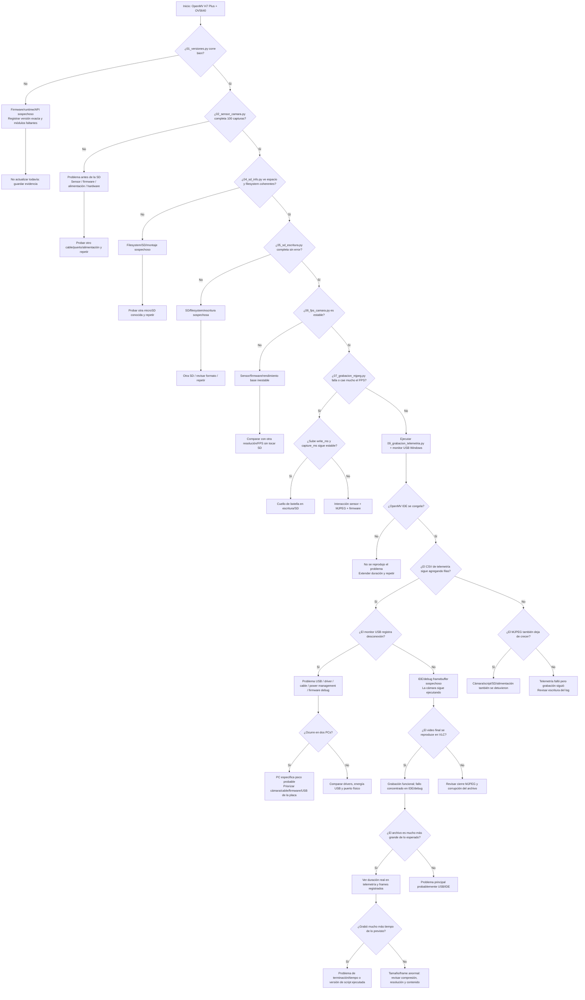

# Árbol de decisión de diagnóstico

Objetivo: decidir qué probar después sin cambiar varias cosas a la vez.



## Versión operativa corta

```text
¿El sensor solo funciona?
│
├─ NO -> sensor / firmware / alimentación / hardware
│
└─ SÍ
   │
   ¿La SD escribe bien sin cámara?
   │
   ├─ NO -> SD / filesystem
   │
   └─ SÍ
      │
      ¿La cámara mantiene FPS sin grabar?
      │
      ├─ NO -> sensor / firmware / rendimiento base
      │
      └─ SÍ
         │
         ¿MJPEG se vuelve lento o falla?
         │
         ├─ SÍ -> comparar tiempo de captura vs escritura
         │          ├─ escritura alta -> SD
         │          └─ ambos raros -> firmware / interacción MJPEG
         │
         └─ NO
            │
            Ejecutar telemetría + monitor USB
            │
            ¿IDE se congela pero CSV/MJPEG siguen?
            │
            ├─ SÍ -> USB / IDE / debug; cámara sigue viva
            │
            └─ NO -> si CSV y MJPEG paran, el problema también está en la cámara
```

## Caso actualmente más interesante

Si ocurre simultáneamente:

```text
OpenMV IDE: sin imagen / FPS 0
MJPEG: sigue creciendo
CSV de telemetría: sigue creciendo
VLC: reproduce el archivo después
```

la interpretación principal es que el proceso de adquisición/grabación dentro de la OpenMV sigue vivo y el fallo está en la capa de comunicación/debug/IDE.

Si además el monitor de Windows muestra una desconexión/reconexión, priorizar:

1. cable USB;
2. puerto/hub USB;
3. administración de energía de Windows;
4. firmware OpenMV/USB debug;
5. hardware USB de la placa.

Si el monitor no muestra ninguna desconexión pero el IDE deja de actualizar el framebuffer, la sospecha sube hacia OpenMV IDE/debug framebuffer.

## Archivos enormes

No usar sólo el tamaño del MJPEG para concluir que algo está corrupto. Primero mirar la telemetría:

- duración real;
- frames realmente guardados;
- FPS efectivo;
- tiempo medio de escritura.

Un archivo de varios GB puede ser simplemente una grabación que continuó durante horas mientras el usuario creyó que el IDE estaba colgado.
